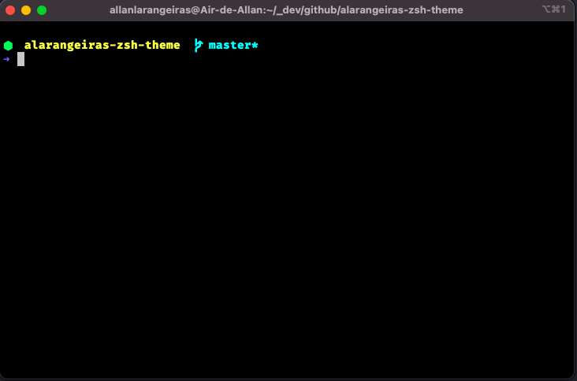

# alarangeiras-zsh-theme

# About
Another custom theme for oh-my-zsh

# Screenshot 

# Dependencies

* [ZSH](https://www.zsh.org/)
* [Oh-My-Zsh](https://ohmyz.sh/)
* [FiraCode Fonts](https://github.com/tonsky/FiraCode)

# How to Install

* Download the repository: `git clone https://github.com/alarangeiras/alarangeiras-zsh-theme`
* Copy the file *alarangeiras.zsh-theme* to $HOME/.oh-my-zsh/themes/
* Edit the file $HOME/.zshrc and change the theme to *alarangeiras*
* Reload the shell